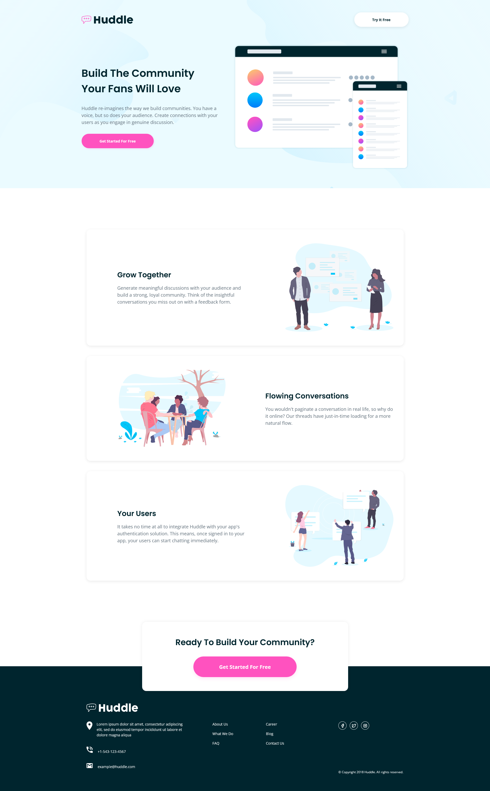
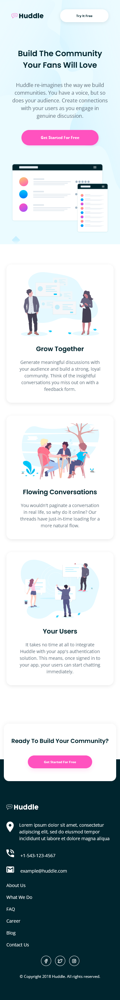

# Frontend Mentor - Huddle landing page with alternating feature blocks solution

This is a solution to the [Huddle landing page with alternating feature blocks challenge on Frontend Mentor](https://www.frontendmentor.io/challenges/huddle-landing-page-with-alternating-feature-blocks-5ca5f5981e82137ec91a5100). Frontend Mentor challenges help you improve your coding skills by building realistic projects.

## Screenshots

## Built with

- Semantic HTML5 markup
- CSS custom properties
- Flexbox
- CSS Grid
- Mobile-first workflow

## Links

- Solution URL: [Frontend Mentor Solution Page](https://www.frontendmentor.io/solutions/huddle-landing-page-with-alternating-feature-blocks-EIi1PuPqEy)
- Live Site URL: [GitHub Pages Site](https://karolbanat.github.io/huddle-landing-page-with-alternating-feature-blocks/)

## Author

- Frontend Mentor - [@karolbanat](https://www.frontendmentor.io/profile/karolbanat)
